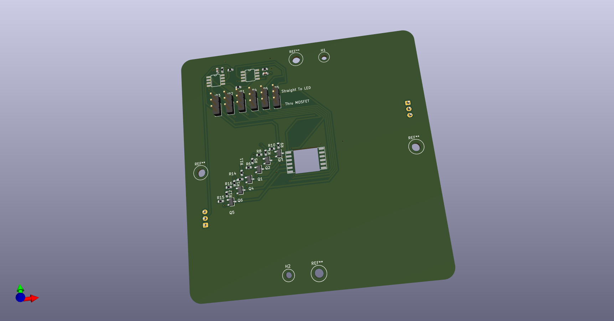
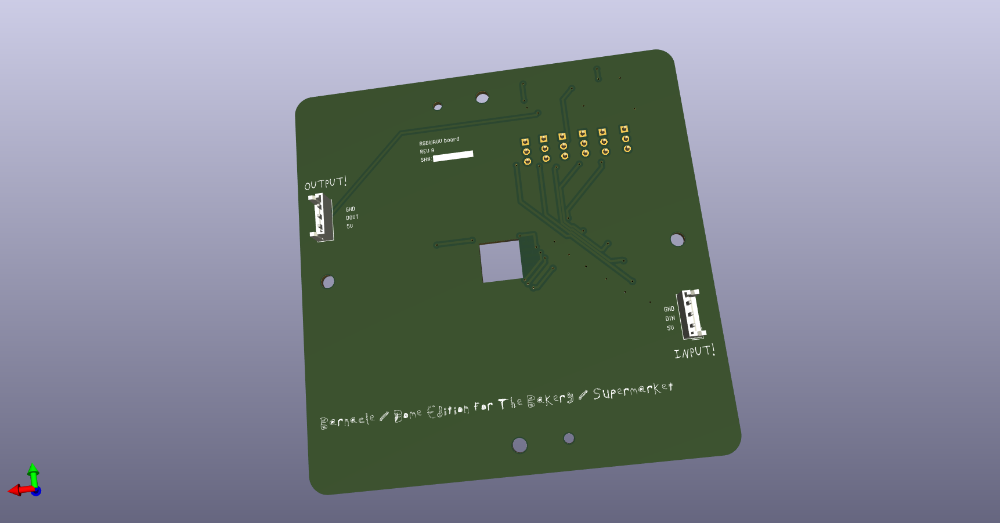

# RGBWA+UV LED with 2x WS2811 chipss

fun collab w/ eddie farr!

Eddie made CamperLightsSMD and I modified and made the dome_rgbwauv_pcb file

# dome_rgbwauv_pcb

For the LED dome / barnacle project
Rev. A:
- features mosfet circuit so more current can go to the led
- jumper so you can toggle between the mosfet circuit and just using the ws2811 output
- 2x holes (H1 & H2) should line up so you can screw this pcb into the plastic dome and use it as base
- JST connector on back so you can connect data and power easily
- 4 other holes to mount standoffs so you can mount this on a substrate?
- hole in middle of LED for heatsink

## REV. A renders
front:

back:

[Rev A Layout PDF](dome_rgbwauv_pcb/dome_rgbwauv_pcb_LAYOUT.pdf)
## Schematic 
[Schematic](dome_rgbwauv_pcb/dome_rgbwauv_Schematic.pdf)